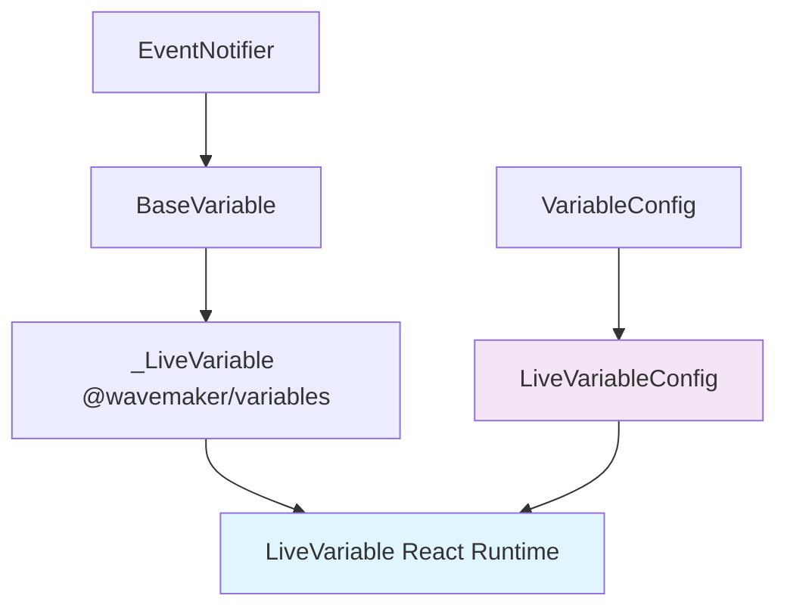
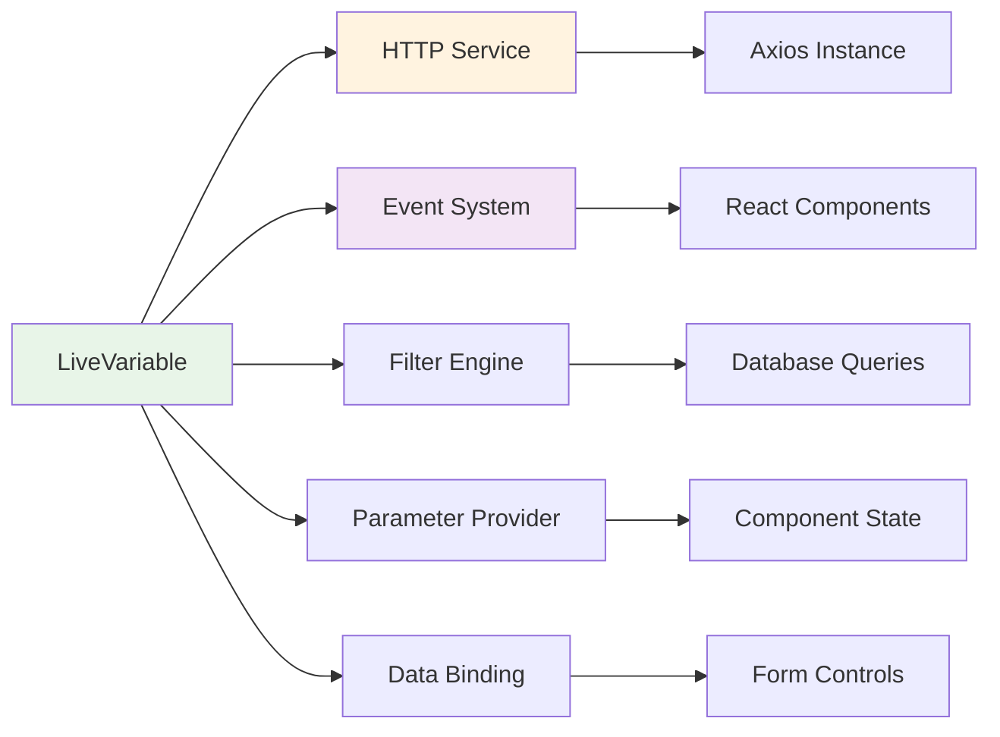
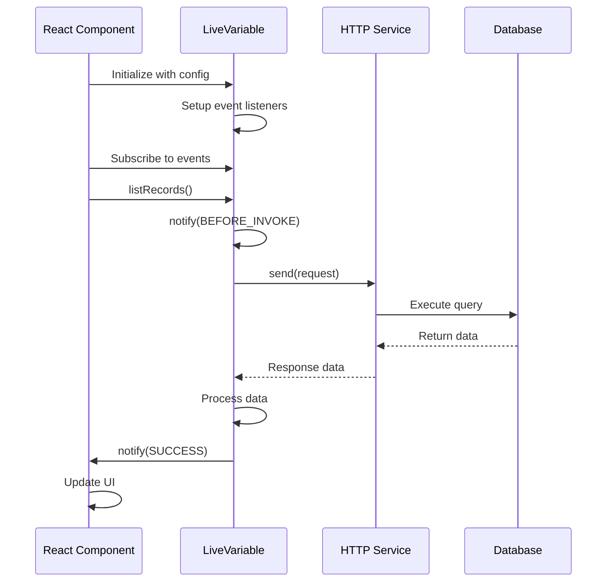
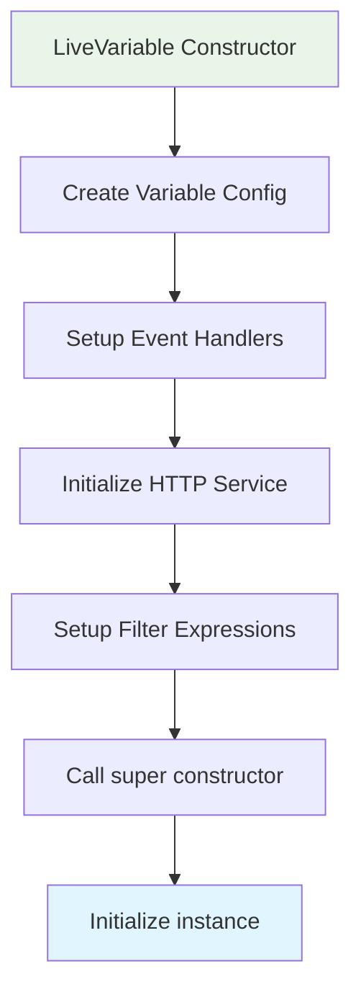
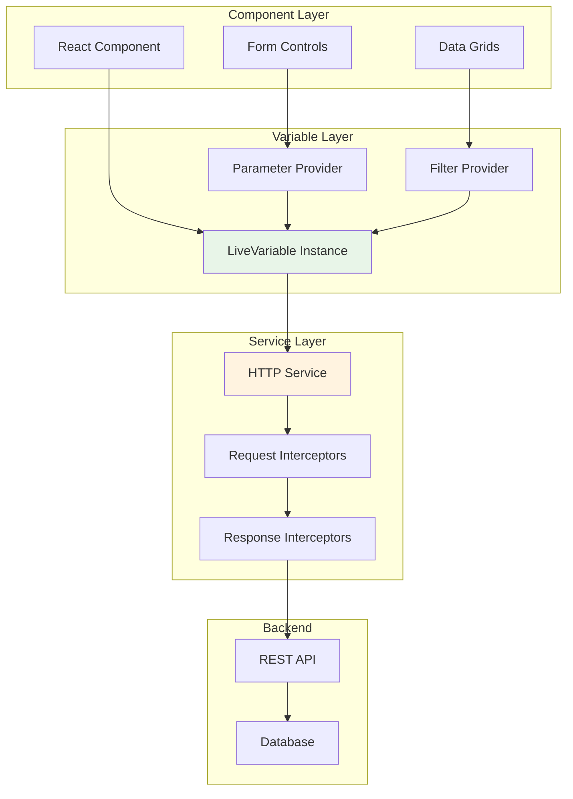
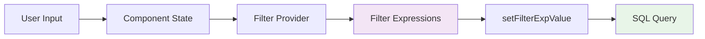
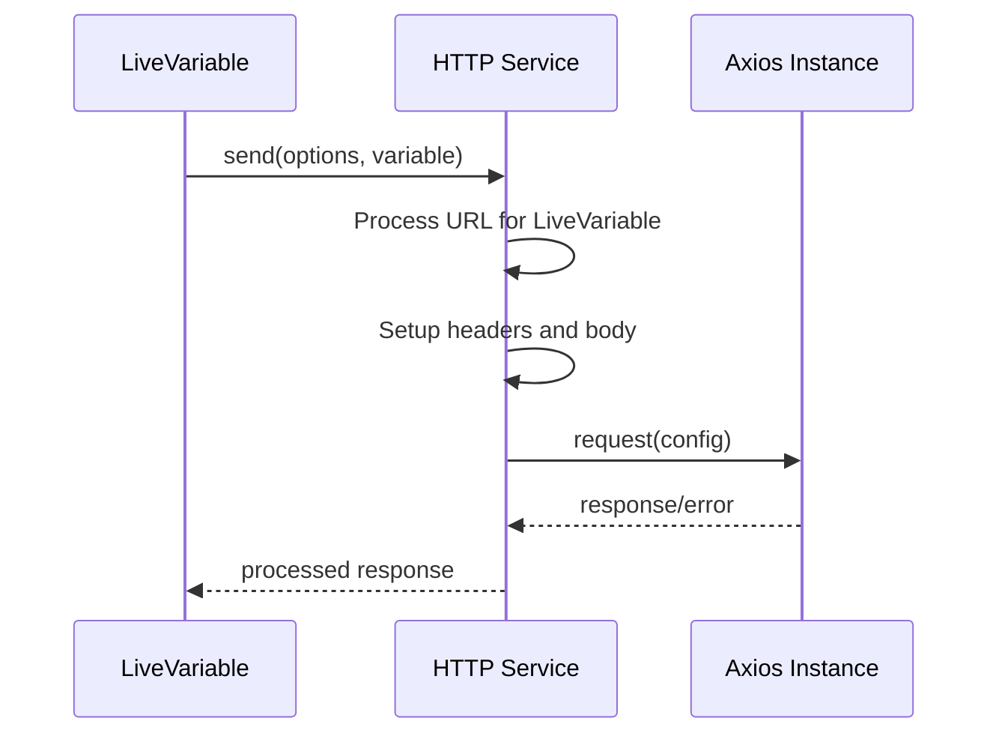
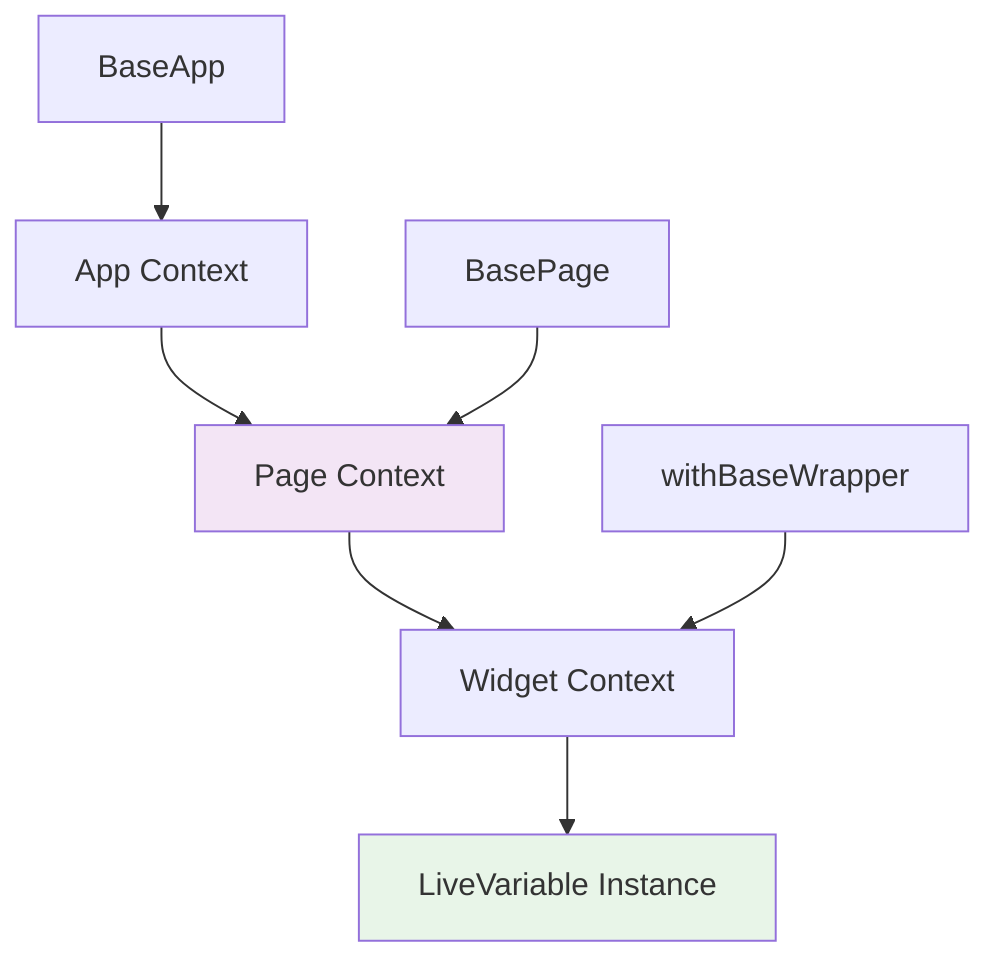
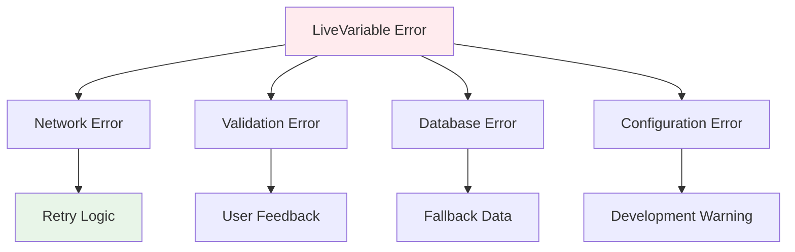

# LiveVariable - WaveMaker React Runtime

## Overview

LiveVariable is a powerful data management component in WaveMaker's React Runtime that provides seamless integration with database operations through a reactive, event-driven architecture. It extends the base `@wavemaker/variables` package to provide enhanced functionality for CRUD operations, automatic updates, filtering, and data binding in React applications.

## Architecture Overview

### Class Hierarchy



### Core Components Integration



## Implementation Details

### 1. LiveVariable Class Structure

The `LiveVariable` class extends the base `_LiveVariable` from `@wavemaker/variables` and provides the following key features:

#### Core Properties

- **params**: Current parameter values
- **filters**: Active filter conditions
- **config**: Configuration object containing all settings

#### Key Methods

- `listRecords()`: Fetch data with filters and pagination
- `updateRecord()`: Update existing records
- `insertRecord()`: Create new records
- `deleteRecord()`: Remove records
- `invokeOnParamChange()`: Handle parameter changes and auto-updates

### 2. Configuration Interface

```typescript
interface LiveVariableConfig extends VariableConfig {
  baseUrl: string; // API endpoint base URL
  maxResults: number; // Maximum records to fetch
  _context: any; // Execution context
  autoUpdate: boolean; // Enable automatic updates
  orderBy: string; // Default sorting
  category: string; // Variable category
  liveSource: string; // Data source identifier
  tableName: string; // Database table name
  tableType: string; // Table type classification
  filterExpressions: any; // Filter configuration
  filterProvider: any; // Dynamic filter provider
  // ... event handlers and other properties
}
```

### 3. Event-Driven Architecture



## Working Model

### 1. Initialization Flow



### 2. Parameter Change Detection

The LiveVariable implements intelligent parameter change detection:

```javascript
invokeOnParamChange() {
  const last = this.params;
  const latest = this.config.paramProvider();

  // Handle filter changes for read operations
  if (this.config.operation === 'read') {
    const lastFilter = this.filters;
    const latestFilter = this.config.filterProvider?.();

    if (!isEqual(lastFilter, latestFilter)) {
      this.setFilterExpValue(latestFilter);
      if (this.autoUpdate && !isEmpty(latestFilter)) {
        this.filters = latestFilter;
        this.invoke();
      }
    }
  }

  // Handle parameter changes
  if (!isEqual(last, latest)) {
    if (this.config.operation === 'read') {
      // Update filter fields for read operations
      forEach(latest, (val, key) => {
        this.filterFields[key] = { 'value': val };
      });
    } else {
      // Update input fields for write operations
      this.inputFields = latest;
    }

    // Auto-invoke if configured
    if (this.autoUpdate && !isUndefined(latest)) {
      this.invoke();
    }
  }
}
```

### 3. Data Flow Architecture



## Key Features

### 1. Automatic Updates

LiveVariables support automatic data fetching when parameters change:

```typescript
// Auto-update configuration
{
  autoUpdate: true,
  paramProvider: () => ({
    userId: currentUser.id,
    status: selectedStatus
  }),
  filterProvider: () => ({
    department: selectedDepartment,
    dateRange: selectedDateRange
  })
}
```

### 2. Filter Management

Dynamic filtering with expression support:



### 3. Event System

Comprehensive event handling for different lifecycle stages:

- **BEFORE_INVOKE**: Triggered before any operation
- **SUCCESS**: Triggered on successful completion
- **ERROR**: Triggered on operation failure
- **AFTER_INVOKE**: Triggered after operation completion

### 4. HTTP Integration



## Integration with WaveMaker Architecture

### 1. Component Binding

LiveVariables integrate seamlessly with WaveMaker components through:

- **Data Binding**: Automatic synchronization with component state
- **Form Integration**: Direct binding with form controls
- **Event Propagation**: Component events trigger variable operations

### 2. Context Integration



### 3. State Management

Integration with React state management:

```typescript
// In BasePage.tsx
const handleVariableEvent = (variableName: string, event: VariableEvents, variable: any) => {
  const updateState = variable;
  updateState.loading = event === VariableEvents.BEFORE_INVOKE;
  updateState.error = event === VariableEvents.ERROR ? variable : null;

  setPageContext(prev => ({
    ...prev,
    Variables: {
      ...prev.Variables,
      [variableName]: updateState,
    },
  }));
};
```

## Usage Patterns

### 1. Basic Implementation

```typescript
const liveVariableConfig: LiveVariableConfig = {
  name: "employeeList",
  operation: "read",
  autoUpdate: true,
  tableName: "Employee",
  maxResults: 50,
  paramProvider: () => ({ department: selectedDept }),
  filterProvider: () => ({ status: "active" }),
  onSuccess: (variable, data) => {
    console.log("Data loaded:", data);
  },
  onError: (variable, error) => {
    console.error("Error loading data:", error);
  },
};

const employeeVariable = new LiveVariable(liveVariableConfig);
```

### 2. CRUD Operations

```typescript
// Create
await employeeVariable.insertRecord({
  inputFields: { name: "John Doe", department: "IT" },
});

// Read
await employeeVariable.listRecords({
  filterFields: { department: "IT" },
});

// Update
await employeeVariable.updateRecord({
  inputFields: { id: 1, name: "Jane Doe" },
});

// Delete
await employeeVariable.deleteRecord({
  inputFields: { id: 1 },
});
```

## Performance Considerations

### 1. Caching Strategy

- Parameter change detection prevents unnecessary API calls
- Filter optimization reduces database load
- Response caching at HTTP service level

### 2. Memory Management

- Automatic cleanup of event subscriptions
- Efficient state updates through React context
- Garbage collection of unused variables

### 3. Network Optimization

- Request cancellation support
- Batch operations where possible
- Intelligent retry mechanisms

## Error Handling

### 1. Error Types



### 2. Error Recovery

- Automatic retry for transient failures
- Fallback data mechanisms
- User notification systems
- Development mode warnings

## Best Practices

### 1. Configuration

- Use descriptive variable names
- Configure appropriate maxResults limits
- Implement proper error handling
- Use autoUpdate judiciously

### 2. Performance

- Optimize filter expressions
- Minimize parameter changes
- Use pagination for large datasets
- Implement proper caching strategies

### 3. Maintainability

- Keep variable configurations centralized
- Document complex filter logic
- Use TypeScript for type safety
- Implement comprehensive testing

## Conclusion

LiveVariable represents a sophisticated data management solution that seamlessly integrates with WaveMaker's React architecture. Its event-driven design, automatic update capabilities, and comprehensive CRUD support make it an essential component for building reactive, data-driven applications.

The architecture promotes separation of concerns, maintainable code, and optimal performance while providing developers with powerful tools for database interaction and state management.
